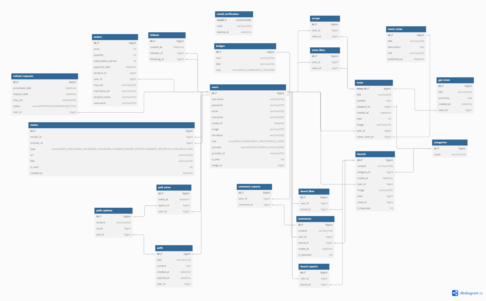

# 📙 쉽게 보는 지식 플랫폼 NEWSION
<p align="center"> <b>2025.04.15 ~ 2025.05.08</b> </p>

<p>URL : </p>
<p>Test ID : </p>
<p>Test PW : </p>
<br>

## Overview
- 뉴션(NEWSION)은 읽기 어려운 뉴스를 공식 계정 및 크리에이터들이 쉽고 명확하게 풀어주는 뉴스 플랫폼입니다.
- 바쁜 현대인을 위해 하루 10개의 주요 뉴스를 3줄 요약으로 핵심 정보를 빠르게 제공합니다.
- 커뮤니티 기능을 통해 뉴스에 대한 지적인 소통과 다양한 경험을 자유롭게 공유할 수 있습니다.
- 뉴스 정보와 사회 이슈에 대해 사용자 투표를 진행할 수 있는 참여형 콘텐츠를 제공합니다.
<br/>

## Members
|PL|BE|BE|BE|
|:--:|:--:|:--:|:--:|
|||||
|[이종현](https://github.com/Heeyeon205)|[구승회](https://github.com/shoot3957)|[송명보](https://github.com/Songmyungbo)|[정지원](https://github.com/jiwon0324)|
<br/>

## Development Environment

### Back-End
- Java 17
- Spring Boot 3.4
- IntelliJ

### Front-End
- React 19
- Vite 6
- Tailwindcss 4.1
- Node.js 22.13
- npm 10.9
- Visual Studio Code

### Communication
- Notion
- Slack
- Discode

### Project Management
- Git
- GitHub

<br/>

## Tech Stack

### Back-End
<p>
  
  
  <br/>
</p> 

### Front-End
<p>
  
  
  
  
  <br/>
</p>

### Database
<p>
  
  
  <br/>
</p>

### Infrastructure
<p>
  
  
</p>

<br/>

## ERD Diagram

<br/>

## Responsibilities
이종현
- 프로젝트 아키텍처 설계
- 데이터베이스 모델링
- RESTful API 서버 설계 및 구현
- Client 서버 설계 및 구현
- 인증 및 인가(Spring Serurity, OAuth2, JWT) 기능 구현
<br>

구승회
- 메인 뉴스 서비스 구현
- Elasticsearch 기반 검색 기능 구현
- Swagger를 활용한 API 문서화
- 프론트엔드 CSS 스타일링
<br>

송명보
- 커뮤니티 게시판 기능 구현
- 사용자 투표 기능 구현
- 결제 시스템 연동 및 구현
- 프론트엔드 CSS 스타일링
<br/>

정지원
- 관리자 기능 개발 및 관리 시스템 구축
- 프론트엔드 CSS 스타일링
<br/>

## Preview
👉 [클라이언트 리포지토리 바로가기](https://github.com/Heeyeon205/newsion-client)
<br/>
<br/>

## Troubleshooting

### 1. Circular Reference
   <br/>
- 댓글 생성 기능 개발 중 BoardService → CommentService → 다시 BoardService가 호출되면서,  
  Spring 빈 생성 시  순환 참조 발생

   <br/>
```java
@Service
@RequiredArgsConstructor
public class BoardCommentManager {
    private final BoardService boardService;
    private final CommentService commentService;
    private final UserService userService;
    private final NoticeService noticeService;

    @Transactional
    public CommentResponse createComment(Long boardId, Long userId, String commentContent) {
        Board board = boardService.findById(boardId);
        User user = userService.findByUserId(userId);

        Comment comment = Comment.builder()
                .board(board)
                .user(user)
                .content(commentContent)
                .build();
        Comment savedComment = commentService.save(comment);

        User sender = userService.findByUserId(userId);
        User receiver = userService.findByUserId(board.getUser().getId());
        String url = "/board/" + board.getId();
        noticeService.createAndSendNotice(sender, receiver, Notice.Type.BOARD_COMMENT, url, "회원님의 게시글에 댓글을 달았습니다.");
        return new CommentResponse(savedComment);
    }

    @Transactional
    public void deleteComment(Long commentId, Long userId) {
        Comment comment = commentService.findById(commentId);
        userService.matchUserId(comment.getUser().getId(), userId);
        commentService.delete(comment);
    }
}
```
- 댓글과 연관된 공통 역할을 수행하는 `BoardCommentManager` 클래스를 새로 생성.  
  BoardService, CommentService, UserService, NoticeService를 모두 Manager에 주입하고,  
  각 서비스들은 본연의 역할만 수행하며, 공통 로직은 매니저 클래스에서 처리한다.


비즈니스 로직의 일관성과 캡슐화를 유지하기 위해 각 서비스끼리만 의존하는 개발 과정에서 발생한 문제였으며, 이를 해결하기 위해 위와 같은 구조로 리팩토링하여 순환 참조를 피했다. 하지만 최초의 프로젝트 설계부분에서 좀 더 명확히 책임을 분리하는 방법으로 사전에 예방하는 것이 더 나은 방법이라고 생각한다.

<br/>

## Future Improvements
1. 정기 구독 서비스를 도입해, 결제 모델과 연계된 AI 요약 뉴스 서머리를 구독 고객에게 매일 아침 뉴스레터로 발송하는 기능 추가
2. 일반 사용자가 작성한 사설 및 아티클을 관리자에게 제출하여, 크리에이터 권한을 신청할 수 있는 기능 추가

<br/>
